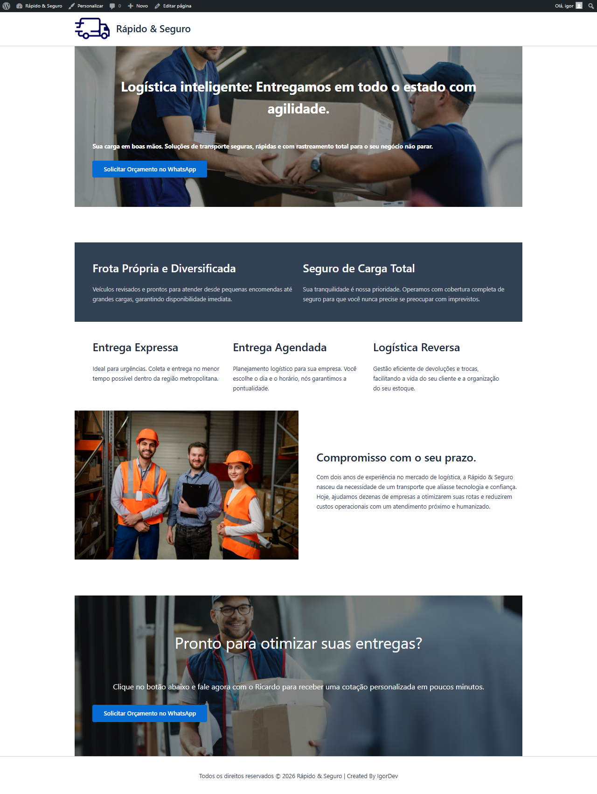

# 🚚 Case de Estudo: Rápido & Seguro Logística

Este é o meu primeiro projeto prático no ecossistema **WordPress**, desenvolvido em **2026**. O projeto marca o início da minha jornada como desenvolvedor WP, focado em criar soluções profissionais utilizando as ferramentas mais modernas e nativas da plataforma.

## 📸 Visualização do Projeto
Abaixo, o registro completo da Landing Page desenvolvida:

*Legenda: Screenshot da One-Page focada em conversão e profissionalismo.*

---

## 🎯 Objetivo do Projeto
O desafio foi criar uma **Landing Page (One-Page)** para uma empresa fictícia de logística ("Rápido & Seguro"). O foco principal foi garantir uma presença digital que transmitisse confiança, seriedade e facilitasse o contato direto do cliente via WhatsApp.

## 🛠️ Tecnologias e Ferramentas
* **CMS:** WordPress 6.x (Versão estável de 2026).
* **Hospedagem Local:** [Local WP](https://localwp.com/).
* **Tema:** [Astra](https://wpastra.com/) (Versão gratuita, focada em performance).
* **Editor:** **Gutenberg** (Block Editor nativo).
* **Branding:** Logotipo e iconografia desenvolvidos via Canva.

## 🚀 Competências Desenvolvidas
Neste projeto, apliquei e consolidei os seguintes conhecimentos:

* **Design com Blocos Natos:** Utilização estratégica de blocos de *Cobertura (Cover)*, *Grupo*, *Colunas* e *Mídia e Texto* para criar um layout fluido sem depender de Page Builders pesados.
* **Hierarquia Visual:** Organização de títulos (H1, H2, H3) e espaçamentos para guiar o olhar do usuário.
* **Identidade Visual WP:** Configuração de paleta de cores global, tipografia e Favicon através do Personalizador do WordPress.
* **Conversão (CTA):** Implementação de botões inteligentes com links de API para WhatsApp com mensagens personalizadas.
* **Resolução de Problemas (Troubleshooting):** Ajuste fino de elementos de post para corrigir comportamentos de exibição do tema (como a duplicação de imagens destacadas).

---

## 👨‍💻 Autor
**IgorDev**
*Desenvolvedor WordPress em evolução*

> *Este é um projeto de estudo. Sinta-se à vontade para entrar em contato para trocarmos experiências sobre WordPress e desenvolvimento web!*
